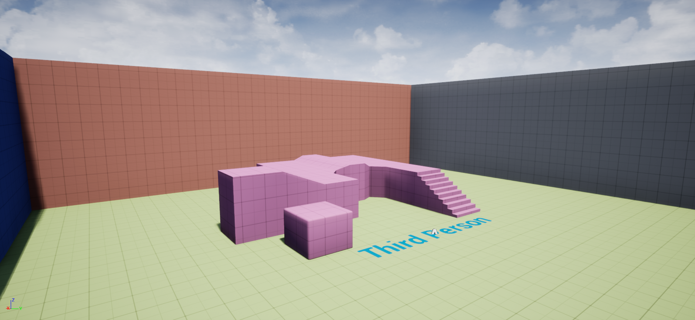
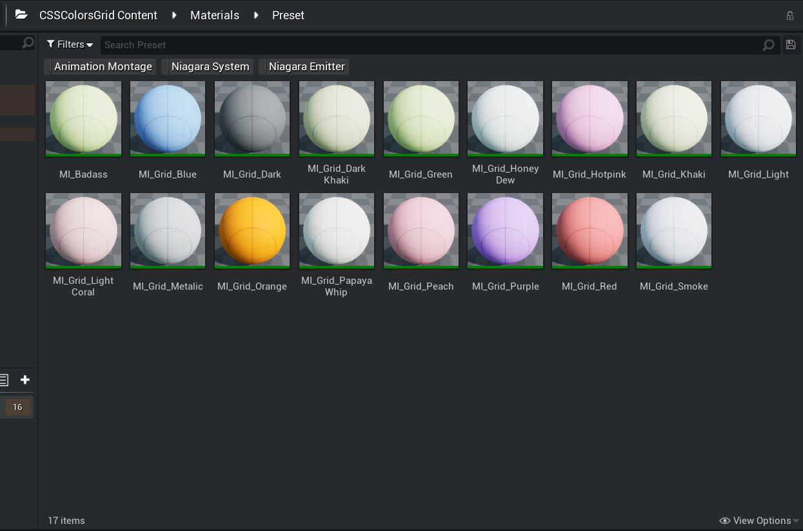
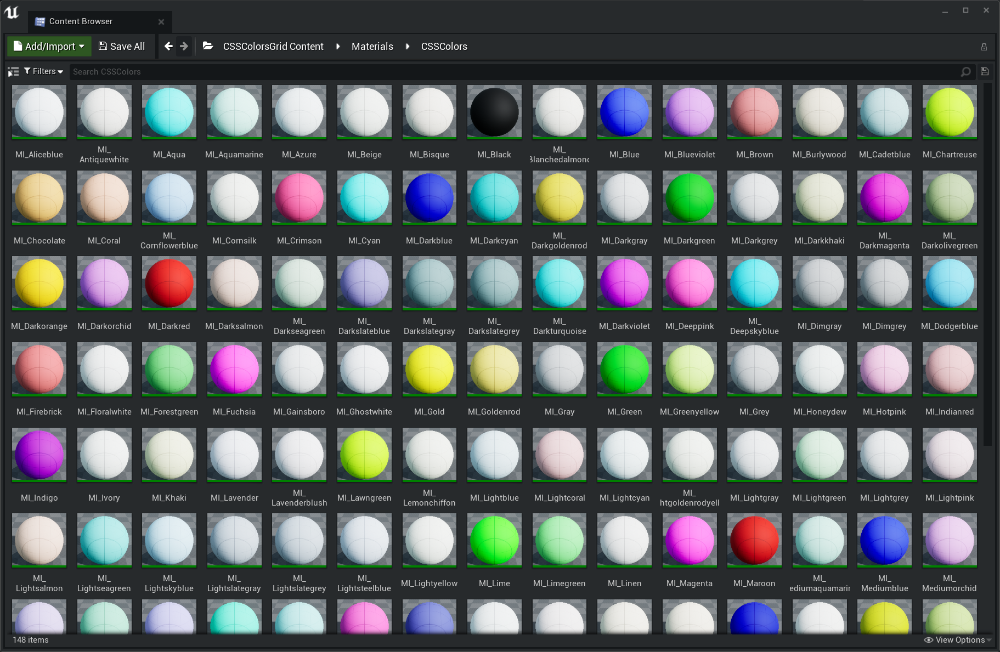

# CSSColorsGrid

CSSColors Grid is an Unreal Engine Plugin with a set of materials designed to assist in level prototyping and greyboxing, with Material Instances generated from [CSS Color names (140 of them)](https://htmlcolorcodes.com/color-names/)

## Installation

[Download the latest release](https://github.com/mklabs/ue4-CSSColorsGrid/releases) or clone the repository and put it in your Engine/Plugins directory (to make it available for all projects) or in your Project's Plugins directory (for a specific project).

Once installed, enable the plugin in the Editor Plugins Browser tab (Edit > Plugins > Level Design)

## Materials

The Master Material uses WorldAlignedTexture, with a default 1m size (100 Unreal Units). Works best with with a Grid Snap value of 50 or 100 in the Level Editor.

Preset: Little selection of Material Instances Colors

CSSColors: Full list of css colors as Material Instances

## Credits

Materials are implement following the technique demonstrated by [Tyler McCombs](https://youtu.be/KSXshiA59OA), thank you Tyler for such a good tutorial!

The list for the CSS Color names are coming from [bahamas10's css-color-names repository](https://github.com/bahamas10/css-color-names).

## License

MIT